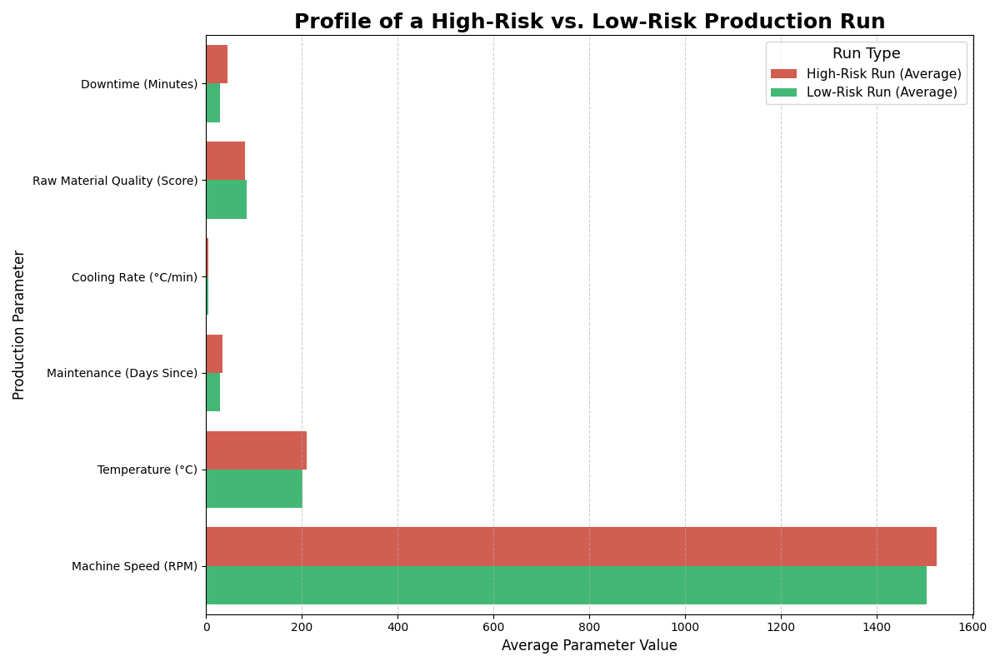

# Data-Driven Optimization of Smartphone Plastic Surface Manufacturing

## 1. Project Introduction & Business Problem
In the rapidly growing smartphone market, our company, a leading producer of high-quality plastic surfaces, faces the challenge of meeting rising demand without investing in new production lines due to cost pressures.

This project leverages data science to optimize the existing production process and increase effective capacity. By analyzing historical production data, we aim to build a machine learning model that identifies the key drivers of production inefficiencies, allowing the management team to make targeted, data-driven decisions to reduce waste and improve output.

---
## 2. About the Dataset
The project utilizes a simulated dataset that mimics real-world production data from a smartphone plastic surface manufacturer. The dataset contains 4,161 records of individual production runs and includes intentional data quality issues such as missing values and outliers to reflect realistic scenarios.

### Feature Descriptions
* `Production Run ID`: Unique identifier for each production run.
* `Date`: The date of the production run.
* `Temperature (°C)`: Temperature setting during extrusion process.
* `Pressure (Pa)`: Pressure setting during extrusion process.
* `Cooling Rate (°C/min)`: Rate at which the plastic is cooled.
* `Machine Speed (RPM)`: Operating speed of the production machine.
* `Raw Material Quality (Score)`: Quality score of the raw material used.
* `Humidity (%)`: The humidity level in the production environment.
* `Ambient Temperature (°C)`: The temperature of the surrounding environment during production.
* `Maintenance (Days Since)`: The number of days since the last maintenance activity on the production equipment.
* `Operator Shift`: Indicates whether the production run occurred during the 'Day' or 'Night' shift.
* `Batch Size (Units)`: The size of the production batch in units.
* `Energy Consumption (kWh)`: The amount of energy consumed during the production run.
* `Production Line`: Identifier for the production line ('Line 1', 'Line 2', 'Line 3').
* `Production Output (Units)`: Number of units produced in the run.
* `Defect Rate (%)`: Percentage of units with defects.
* `Downtime (Minutes)`: Duration of machine downtime during the run.

---
## 3. Project Workflow (CRISP-DM)
This project follows the Cross-Industry Standard Process for Data Mining (CRISP-DM) methodology to ensure a structured and robust approach:

* **Business Understanding:** Defined the goal to increase capacity by reducing waste and inefficiencies.

* **Data Understanding:** Performed extensive Exploratory Data Analysis (EDA) to identify patterns, outliers, and distributions in the data.

* **Data Preparation:** Handled missing values, engineered new features (Energy_per_Unit, Process_Stress_Index), and applied transformations (log transform, scaling) to prepare the data for modeling.

* **Modeling:** Initially attempted to predict Production Output but pivoted to a more actionable target, Defect Rate, after initial models showed no predictive power. Trained several regression models, including Ridge, Random Forest, and Gradient Boosting.

* **Evaluation:** Evaluated models using R-squared, diagnosed overfitting, and used Hyperparameter Tuning (GridSearchCV) to develop a final, robust model. The champion model, a Tuned Random Forest, achieved an R-squared of 0.71 on unseen test data.

* **Deployment:** The final model and preprocessor were deployed as an interactive web application using a Flask API and containerized with Docker.

---
## 4. Business Impact Simulation & Actionable Insights
To demonstrate the model's value, we moved beyond simple "what-if" scenarios and used it to analyze real production runs from our test data. The model successfully identified a clear "fingerprint" of a production run that is at high risk of having a high defect rate.

The analysis answers the key business question: "What does a problematic production run look like?"

Our final model, a Tuned Random Forest with an R-squared of 0.71, compared the average production parameters of high-risk runs (those predicted to have many defects) against low-risk runs. The results from this analysis are shown in the chart below and provide a clear, data-driven priority list for the management team.

As the chart clearly shows, high-risk runs consistently exhibit a combination of negative factors, including:

* **Significantly More Downtime** (+15 minutes on average)
* **Noticeably Lower Raw Material Quality** (-4 points on average)
* **Higher Operating Temperatures** (+10°C on average)
* **Longer Delays in Maintenance** (+4.6 days on average)

#### Conclusion: 
By using the model's insights to focus on minimizing downtime, the company can significantly reduce waste, thereby increasing the effective capacity of existing production lines without new capital investment.

---
## 5. Deployment: Interactive Web Application
To make the model's insights accessible and actionable for the management team, two interactive applications were developed.

### Option 1: Streamlit Dashboard (Recommended for Interactive Analysis)
A user-friendly web application was built using Streamlit, a framework designed for turning data scripts into interactive tools. This dashboard allows the management team to use sliders and dropdowns to adjust production parameters and see the predicted defect rate in real-time. It's the perfect tool for demonstrating the model's value and exploring "what-if" scenarios during presentations.

#### How to Run the Streamlit Application:

* **Prerequisites:** Ensure all libraries from `requirements.txt` are installed in your environment (`pip install -r requirements.txt`).
* **Run the App:** Open a terminal in the project's root directory and run:

        streamlit run streamlit_app.py
* **Access the Web App:** A new tab should automatically open in your web browser.

### Option 2: Flask API with Docker
For a more robust, production-oriented deployment, the model was also packaged as a lightweight, portable API service using Flask and Docker. This containerized application can be deployed on any server (cloud or on-premise) to serve predictions to other software systems.

#### How to Run the Deployed Application:

* **Prerequisites:** Docker Desktop must be installed and running.
* **Build the Docker Image:** Open a terminal in the project's root directory and run:

        docker build -t defect-predictor .

* **Run the Docker Container:**

        docker run -p 5001:5000 defect-predictor

* **Access the Web App:** Open your web browser and navigate to `http://localhost:5001`.

---
## 5. Repository Structure

    ├── data/
    │   └── smart_phone_surface_plastic_manufacture.csv # The raw dataset
    ├── images/
    │   └── (Contains charts and plots generated during analysis)
    ├── model/
    │   ├── defect_rate_predictor.joblib # The final, trained machine learning model
    │   └── preprocessor.joblib      # The data preprocessing pipeline
    ├── notebooks/
    │   ├── smart_phone_surface_plastic_manufacture_data_simulation.ipynb
    │   └── process_optimization_modeling.ipynb
    ├── src/
    │   ├── __init__.py
    │   ├── components/
    |   |   ├── __init__.py
    |   |   ├── data_ingestion.py
    |   |   ├── data_transformation.py
    |   |   └── model_trainer.py
    │   ├── pipeline/
    |   |   ├── __init__.py
    |   |   ├── predict_pipeline.py
    |   |   └── train_pipeline.py
    │   └── utils.py
    ├── static/
    │   └── style.css                # CSS for the web application
    └── templates/
        └── index.html               # HTML for the web application
    ├── test/
    │   ├── business_impact_scenario_1.ipynb
    │   ├── business_impact_scenario_2.ipynb
    │   ├── business_impact_scenario_3.ipynb
    │   └── business_impact_scenario_4.ipynb
    ├── README.md                  # This file
    ├── app.py                     # Flask API script for the web application
    ├── streamlit_app.py           # Streamlit API script for the web application    
    ├── Dockerfile                 # Instructions for building the Docker container
    ├── requirements.txt           # Python dependencies
    ├── LICENSE                    # MIT License

## Technologies Used
* **Data Analysis & Modeling:** Python, pandas, NumPy, scikit-learn, Matplotlib, Seaborn
* **Web Application & Deployment:** Flask, Docker, Streamlit
* **Environment:** Jupyter Notebooks, VS Code